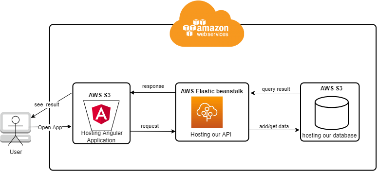
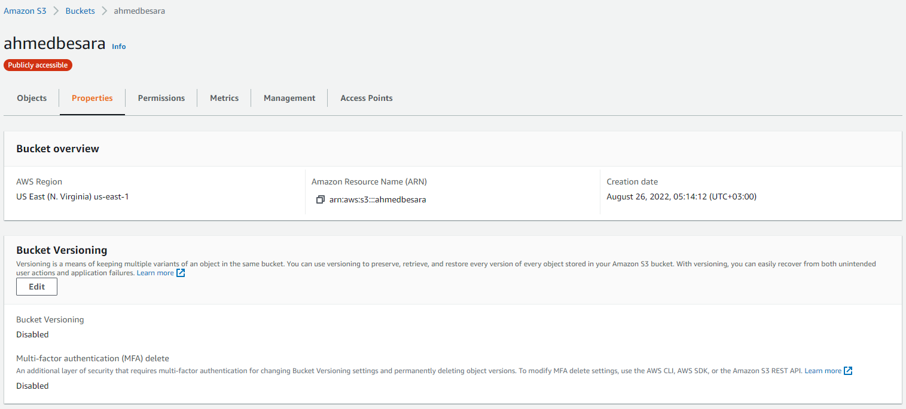
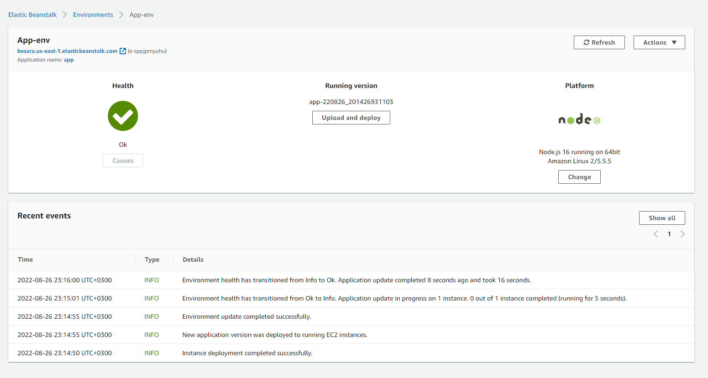
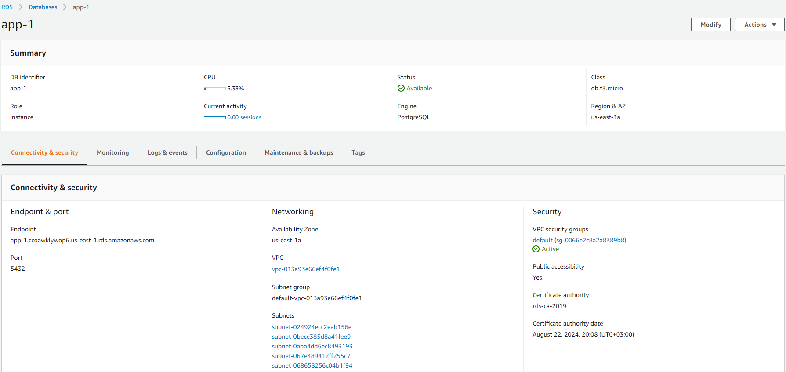

## Udagram Project: final Project in Hosting a Full-Stack Application

[](https://circleci.com/gh/BeSaRa/udagram)

it is cloud based Application, to practice what I have learned in the course using circle CI/CD and Amazon Web Services

### installation

clone the repo then follow the below instructions to install app dependencies

| project                      | description                                                                                                                                              |
|------------------------------|----------------------------------------------------------------------------------------------------------------------------------------------------------|
| udagram-api (API)            | from root folder open the terminal and type `cd udagram\udagram-api` then click enter then type `npm install` to install the backend dependencies        |
| udagram-frontend (Front-end) | from root folder open the terminal and type `cd udagram\udagram-frontend` then click enter then type `npm install` to install the front-end dependencies |

### required to run the application without any issues

* postgres database to connect to it

I used docker container to connect to the database for more info check
this [link](https://hub.docker.com/_/postgres "postgres DOCKER OFFICIAL IMAGE")

### environment variables

create .env file inside the udagram\udagram-api and fill below variables with your own

```
POSTGRES_USERNAME=admin
POSTGRES_PASSWORD=admin
POSTGRES_HOST=localhost
POSTGRES_DB=app
PORT=8080
URL=http://localhost:4200
AWS_BUCKET 
AWS_REGION
AWS_PROFILE
JWT_SECRET=ahmed
```

### Run the Application

to run the application without any issues, you have to run first the udagram-api app then after that run the front-end
app

| app                          | how to run                                                                                                                                         | notes                                                                                                                                          |
|------------------------------|----------------------------------------------------------------------------------------------------------------------------------------------------|------------------------------------------------------------------------------------------------------------------------------------------------|
| udagram-api (API)            | go to udagram-api then `npm install ` or `yarn` You can access through this link `http://localhost:8080` just to make sure it is working           | change the port in case if you override the port number in `.env` file                                                                         |
| udagram-frontend (Front-end) | go to udagram-frontend then `npm install ` or `yarn` after that you can access the `http://localohst:4200` and start interact with the application | default port is `4200` but if it is busy for some reason check the terminal and you will find the full url with the new port to access the app |

### Application Architecture



### Components screenshots

#### AWS S3



### AWS Elastic Beanstalk



### AWS RDS



### Built With

- [Angular](https://angular.io/) - Single Page Application Framework
- [Node](https://nodejs.org) - Javascript Runtime
- [Express](https://expressjs.com/) - Javascript API Framework

### License

[License](LICENSE.txt)
