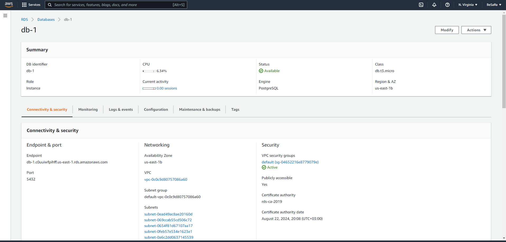

### Infrastructure description

There are 3 services from AWS and CircleCI to automate deployment process, to make this application up and running!

* **AWS Relational Database Service (RDS)** : this service Hosting our database, I'm using Postgres instance
* **AWS Elastic Beanstalk (EB)** : this service Hosting our Backend API application
* **AWS Simple Storage Service (S3)** : this service Hosting our front-end Application , you can access it by
  clicking [here](http://besara.s3-website-us-east-1.amazonaws.com/#/home)
* **CircleCi** : is a continuous integration and continuous delivery platform that can be used to implement DevOps
  practices

### Application Architecture

### User Flow

As you can see in the above diagram the user will open the application link in his browser and **AWS S3** will serve the
frontend app,
which can user interact with it, for example to register or add a new feed item the app will make request for the
backend that already hosted in
**AWS EB** Which in turn sends the data to be saved in **AWS RDS** which responsible for saving the data that came from
the user also **AWS EB** can ask **AWS RDS** for data to retrieve it display it for the user like the feed items

### App Components Screenshots

below screenshots from application components on AWS

#### AWS S3

### AWS Elastic Beanstalk

### AWS RDS

### CircleCi

**[back](../README.md)**
