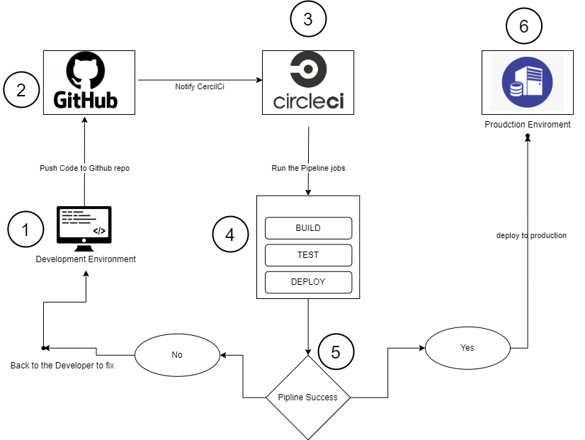
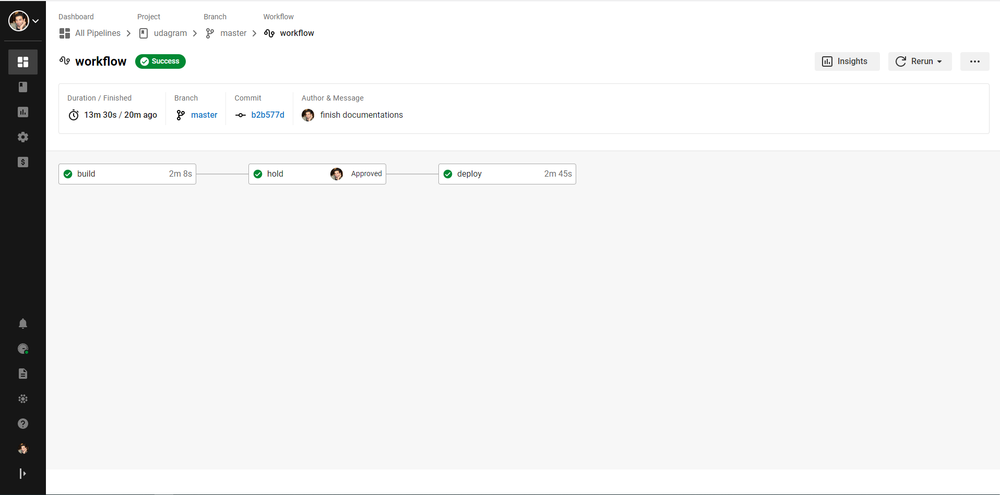
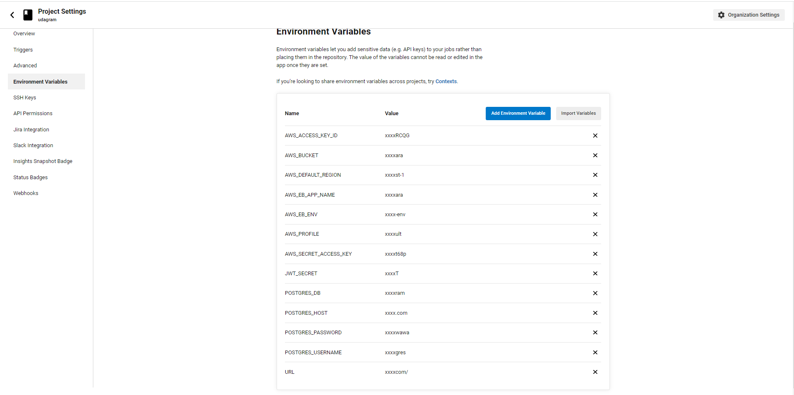

### Pipeline process

A pipeline process is a process that drives software development through a path of building, testing, and deploying
code, also
known as CI/CD. By automating the process, the objective is to minimize human error and maintain a consistent process
for how software is released

### Pipeline Diagram

Here is diagram for my Pipeline Process for this application

1. **dev environment:**  when I finish the app development push the code to the repository on GitHub.
2. **GitHub Repository:** will Notify the CircleCi that repo has a new code changes.
3. **CircleCi:** will start the Pipeline and run the jobs.
4. **Jobs:** after it finish we can check the result of it.
5. **Pipeline Success:** if yes it will go to next Step and deploy the code to production env, else it goes to the
   developer in Step 1, and he should check why the Pipeline failed, and he can provide his fix, and start the cycle
   again.
6. **Production environment:** her we can see our hard work :) the application deployed and users can interact with it.

below screenshot from the latest build on CircleCi

CircleCi secrets

[back](../README.md)

